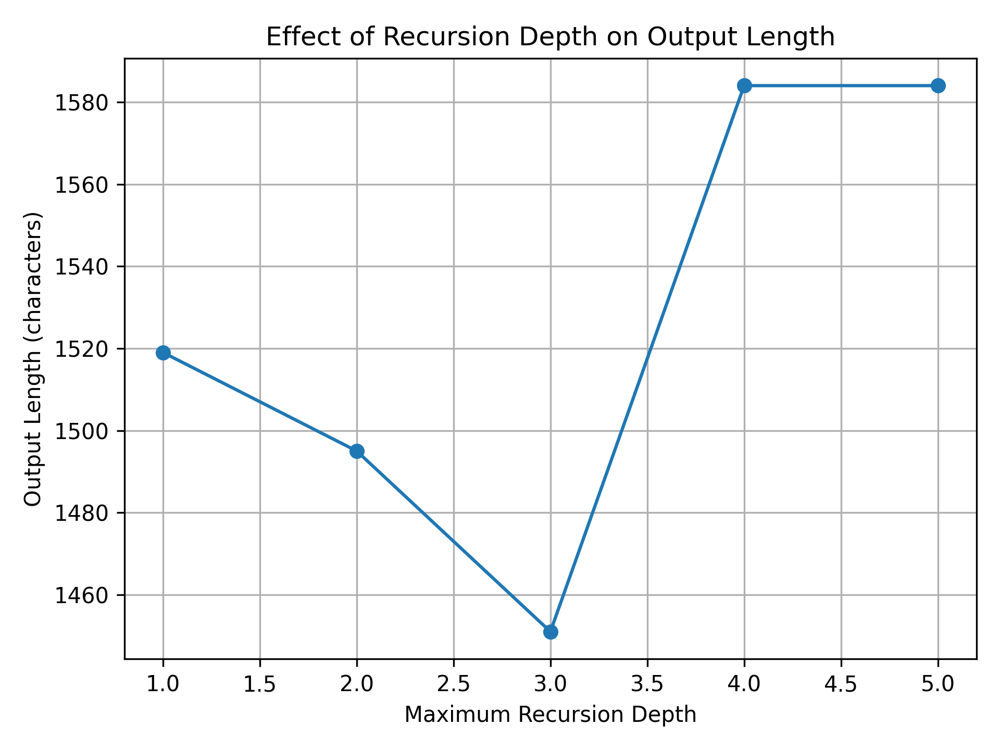
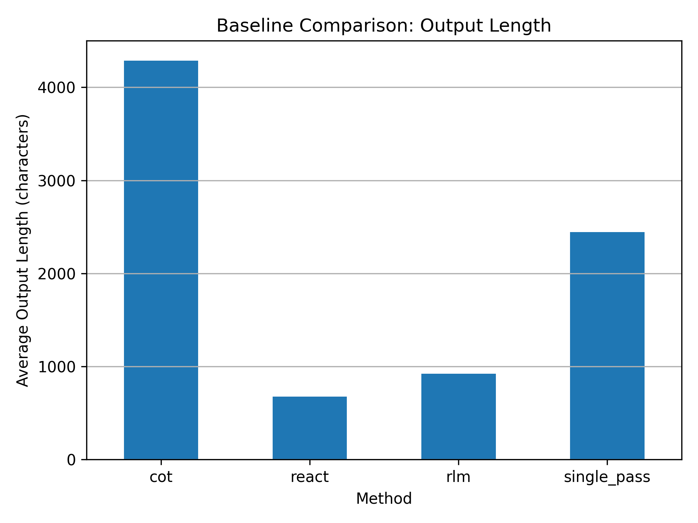

# Recursive Self-Refinement Agents (RLM-Agent)

This repository contains the implementation and experimental evaluation of **Recursive Self-Refinement Agents**, an inference-time framework for improving the reliability and structure of agentic Large Language Models (LLMs) through **controlled recursion**.

The project accompanies the research paper:

> **Recursive Self-Refinement Agents for Reliable LLM Inference**
> *(under submission)*

---

## 📌 Motivation

Agentic LLM systems often suffer from **error accumulation**: once an incorrect step is produced, subsequent reasoning builds on flawed outputs. Common approaches such as Chain-of-Thought and ReAct encourage reasoning but **lack mechanisms for revision and convergence control**.

This work explores a simple but principled question:

> **Can an LLM iteratively improve its own outputs at inference time, if recursion is explicitly controlled?**

---

## 🧠 Core Idea

We introduce a **Recursive Self-Refinement Agent (RLM-Agent)** that separates reasoning into four explicit roles:

* **Generator** – produces an initial solution
* **Critic** – evaluates correctness and gaps
* **Refiner** – applies targeted fixes
* **Controller** – decides when to stop recursion

Recursion is treated as a **first-class design primitive**, not a prompt heuristic.

---

## 🏗️ Architecture Overview

The agent follows a controlled loop:

```
Generator → Critic → Refiner → Controller
                     ↑               ↓
                     └───── (repeat if needed)
```

The controller halts recursion when improvements saturate, preventing over-refinement and unnecessary computation.

---

## 📊 Experimental Results

### Figure 1 — Recursion Depth Ablation

This figure shows how output length varies with maximum recursion depth.



**Key observation:**
Recursive self-refinement converges within **2–3 iterations**. Deeper recursion provides no additional benefit and may increase verbosity, demonstrating **diminishing returns**.

---

### Figure 2 — Baseline Comparison

This figure compares average output length across methods.



**Takeaways:**

* Chain-of-Thought produces verbose outputs
* ReAct is concise but shallow
* **RLM-Agent produces more structured outputs with reduced verbosity**

---

## 🧪 Baselines

We compare the proposed method against three strong baselines:

| Method               | Description                                  |
| -------------------- | -------------------------------------------- |
| Single-pass          | One LLM call, no reasoning guidance          |
| Chain-of-Thought     | One LLM call with explicit reasoning         |
| ReAct                | Multi-step reasoning without self-correction |
| **RLM-Agent (ours)** | Recursive self-refinement with control       |

All methods use the **same LLM backend**, temperature, and task inputs.

---

## 📁 Repository Structure

```
rlm-agent/
├── src/
│   ├── agents/        # Generator, Critic, Refiner, Controller
│   ├── baselines/     # Single-pass, CoT, ReAct
│   ├── graph/         # LangGraph wiring
│   ├── core/          # State + LLM abstraction
│   ├── eval/          # Evaluation & ablation scripts
│   └── main.py        # Unified runner
├── results.csv
├── recursion_ablation.csv
├── fig_recursion_ablation.png
├── fig_baseline_comparison.png
└── README.md
```

---

## ⚙️ Setup

### Requirements

* Python **3.10 – 3.12**
* Mistral API key

Install dependencies:

```bash
pip install -r requirements.txt
```

Create a `.env` file:

```env
MISTRAL_API_KEY=your_api_key_here
```

---

## ▶️ Running Experiments

### Run all baselines + RLM-Agent

```bash
python -m src.main
```

### Run full evaluation

```bash
python -m src.eval.run_eval
```

### Run recursion-depth ablation

```bash
python -m src.eval.run_recursion_ablation
```

---

## 🔬 Key Findings

* Recursive self-refinement improves output structure without excessive verbosity
* Effective refinement occurs within **2–3 iterations**
* Explicit control is essential to prevent over-refinement
* Multi-step reasoning alone (ReAct) is insufficient

---

## 📉 Limitations

* Evaluated on a limited set of tasks
* Uses proxy success metrics
* Single LLM backend

These limitations are discussed in detail in the accompanying paper.

---

## 📌 Citation

If you find this work useful, please cite:

```bibtex
@article{rlm_agent_2026,
  title={Recursive Self-Refinement Agents for Reliable LLM Inference},
  author={Atharva K. A.},
  year={2026}
}
```

---

## 📬 Contact

For questions, feedback, or collaboration:

**Atharva K. A.**
AI & Machine Learning Engineering
📧 (add email)
🔗 (add LinkedIn / Google Scholar)

---

## ⭐ Final Note

This repository is designed to be:

* **Reproducible**
* **Minimal**
* **Research-first**

If you are exploring **agent reliability, inference-time optimization, or recursive reasoning**, this work provides a clean and extensible starting point.


